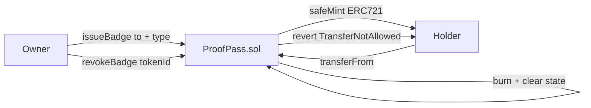

# ProofPass — Soulbound credential NFTs issued by a trusted authority

> Issue verifiable on-chain badges to wallets. Non-transferable by design — a credential that proves what you earned, not what you bought.


🔗 **Live demo:** _coming soon_
📜 **Contract (Sepolia):** _deploy pending_

---

## What it does

- The **owner** (issuing authority) mints credential badges to specific wallet addresses.
- Each badge carries a **badge type** stored on-chain (e.g., `"Certified Blockchain Dev"`, `"Hackathon Winner"`).
- Badges are **soulbound** — `transferFrom` and `safeTransferFrom` always revert.
- The owner can **revoke** any badge, which burns the token and frees the holder's slot.
- After revocation, the **same address can receive a new badge** (useful for re-certification).
- One badge per address at a time.

## How it works



## Tech stack

| Layer | Tech |
|-------|------|
| Smart contract | Solidity 0.8.24 |
| Standards | OpenZeppelin ERC721, Ownable |
| Dev / testing | Foundry (forge, anvil) + fuzz testing |
| Frontend | Next.js + wagmi + viem + RainbowKit |
| Network | Ethereum Sepolia testnet |

## Key design decisions

**Soulbound via transfer override**
Both `transferFrom` and `safeTransferFrom` are overridden to always `revert TransferNotAllowed()`. The badge is tied to the original recipient — it cannot be sold or transferred, making it a genuine proof of achievement rather than a tradeable asset.

**`badgeType` stored on-chain**
The credential type is stored as a `string` in a mapping, not in a metadata URI. This makes it queryable from any contract or frontend without relying on IPFS or external APIs.

**`hasBadge` mapping for O(1) duplicate check**
Checking whether an address already has a badge is O(1) — no iteration needed. The `issueBadge` function reverts early if the recipient already holds one.

**Revoke + re-issue pattern**
When a badge is revoked, `hasBadge[holder]` is cleared. This allows the owner to re-issue a new badge to the same address (useful for updated certifications). The `totalIssued` counter keeps incrementing — it's a historical count, not current supply.

## Testing ⭐

```bash
forge test -vvv
```

15 tests covering:
- ✅ Badge minted with correct owner and badge type
- ✅ Token IDs increment correctly
- ✅ Emits `BadgeIssued` event
- ✅ Reverts: not owner, already has badge, empty badge type
- ✅ Revoke burns badge and clears state
- ✅ Revoke emits `BadgeRevoked` event
- ✅ Revoke reverts if not owner
- ✅ After revoke, same address can receive a new badge
- ✅ `transferFrom` reverts with `TransferNotAllowed`
- ✅ `safeTransferFrom` reverts with `TransferNotAllowed`
- ✅ `totalIssued` starts at 0
- ✅ `hasBadge` returns false for new address
- ✅ **Fuzz:** 1000 runs — unique token IDs for up to 20 simultaneous badge issues

## Run locally

```bash
forge build
forge test -vvv

cp .env.example .env
# fill in SEPOLIA_RPC_URL and PRIVATE_KEY
source .env && forge script script/Deploy.s.sol \
  --rpc-url $SEPOLIA_RPC_URL --private-key $PRIVATE_KEY --broadcast
```

## What I learned

The soulbound pattern isn't an ERC standard (ERC-5192 exists but isn't widely adopted) — the practical approach is simply overriding `transferFrom` to revert. This taught me that ERC721 is a base you can constrain, not a fixed interface. Storing credential type on-chain also made me appreciate the gas cost trade-off: on-chain strings are expensive but eliminate dependency on external metadata servers, which can go offline.

---

## Contact

**Armando Ochoa** · Smart Contract Developer
📧 armaochoa99@gmail.com · Open to Web3 opportunities.

> Built as part of my blockchain developer journey.
